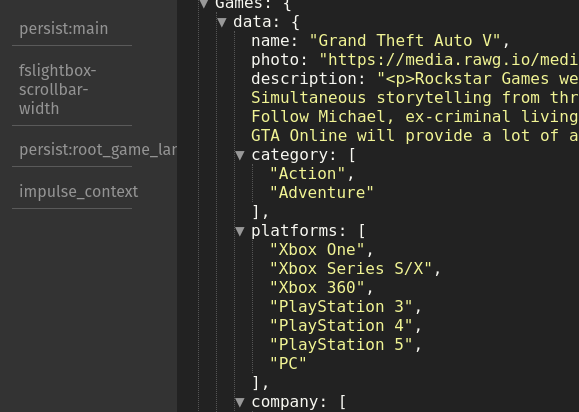

## 🚀 Tecnologias:

- React
- Material UI
- Axios
- React router dom
- Redux
- Redux persist
- Typescript

## 🛑 Como rodar o projeto

- Instalar dependências:

> yarn
> ou
> npm install

- Iniciar projeto:

> yarn start
> ou
> npm run start

## 👩🏻‍💻 Sobre o desenvolvimento

- React
  - Desenvolvido com React Hooks
- Material UI
  - Utilizei componentes
- Redux + Redux Persist
  - Utilizei para gerência o estado global da aplicação

(Interface gráfica de como os dados ficam persistido no Redux)
